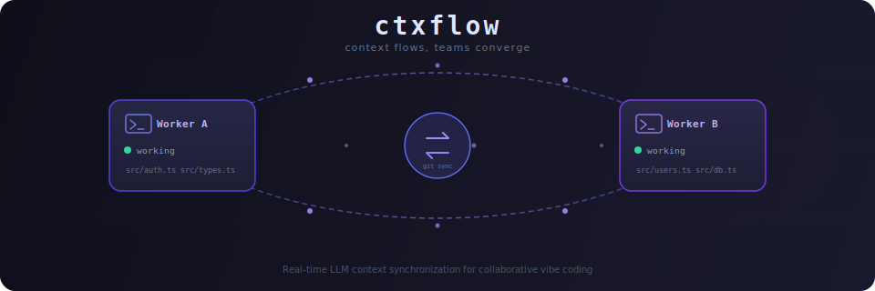

<p align="center">
  
</p>

<p align="center">
  <strong>Real-time LLM context synchronization for collaborative vibe coding</strong>
</p>

<p align="center">
  <a href="README.ko.md">한국어</a> · <a href="LICENSE">MIT License</a>
</p>

---

When multiple developers vibe-code on the same project with LLM assistants, each assistant's context inevitably **diverges** — leading to conflicting approaches, duplicated work, and unmergeable code.

**ctxflow** solves this by synchronizing context across all workers in real time through a git orphan branch. Every LLM assistant automatically sees what others are working on, what decisions they've made, and where potential conflicts lie.

## Features

- **Interactive CLI.** `ctxflow` shows active tasks, lets you join or create — all in one flow.
- **Zero config.** Detects git remote automatically, creates sync channel, installs Claude Code hooks — all on first run.
- **Session-based.** Each terminal session gets its own session ID — even the same user can run multiple tasks simultaneously.
- **Local-first.** Works offline, syncs when network is available.
- **No merge conflicts by design.** Each worker writes only to their own files (keyed by session ID) — structural conflict elimination.
- **Adaptive context injection.** Summaries when things are calm, detailed warnings when file overlaps are detected.
- **Background daemon.** Configurable sync loop (default 5s) with heartbeat, invisible to the user.
- **Security hardened.** Path traversal protection, input size limits, atomic file operations, and lock staleness detection.

## How It Works

```
┌─────────────┐                          ┌─────────────┐
│  Worker A    │    git orphan branch     │  Worker B    │
│  (Claude)    │◄────── "ctxflow" ──────►│  (Claude)    │
│              │     auto push/pull       │              │
│ PreToolUse   │      every 5 sec         │ PreToolUse   │
│ hook injects │                          │ hook injects │
│ B's context  │                          │ A's context  │
└─────────────┘                          └─────────────┘
```

Each worker's LLM gets a `<system-reminder>` injected before every tool use, containing the other workers' status, recent file changes, and approach notes.

## Getting Started

### Prerequisites

- **Node.js** 18+
- **Git** with a configured remote (GitHub, GitLab, etc.)
- **Claude Code** (for automatic hook integration)

### Installation

```bash
git clone https://github.com/torajim/ctxflow.git
cd ctxflow
npm install
npm run build
npm link
```

Verify installation:

```bash
ctxflow --version   # 0.1.0
```

### Uninstallation

```bash
npm unlink -g ctxflow
```

### Quick Start

#### 1. Start your task

Open a terminal in your project directory and run:

```bash
cd my-project
ctxflow
```

On first run, ctxflow will:
- Use your `git config user.name` as your worker identifier (prompts if not set)
- Show active tasks or prompt you to create a new one
- Create the `.ctxflow/` directory (automatically gitignored)
- Install Claude Code hooks in `.claude/settings.local.json`
- Start the background sync daemon

You can also directly start a new task:

```bash
ctxflow start "Implement JWT auth middleware"
```

#### 2. Code with your LLM

The session is auto-saved, so just launch Claude Code — hooks pick it up automatically:

```bash
claude
```

You can also run `ctxflow start` from **within** an existing Claude Code session using the Bash tool. No separate terminal needed.

From now on, every time Claude uses a tool, it automatically receives context about what your teammates are doing:

```
[ctxflow] collaboration status:
- jimin: "User profile API" | Using Drizzle ORM, building REST endpoints
  recent: src/api/users.ts (+CRUD endpoints), src/db/schema.ts (+users table)

[ctxflow] When making key architectural decisions or changing your approach,
please update .ctxflow/context/<session-id>.md with a brief summary.
```

#### 3. Your teammate joins

On another machine (or terminal), your teammate joins an existing task or creates a new one:

```bash
cd my-project          # same repo, same remote
ctxflow                # see active tasks and join one
```

```
ctxflow - collaboration status

Active tasks:
  [1] Implement JWT auth middleware (abc123)
      stefano (working, just now)
  [N] Create a new task

Select a task to join, or N to create new:
```

Or join directly by task ID:

```bash
ctxflow join abc123
```

Their Claude instance now automatically sees your work context, and yours sees theirs.

#### 4. Conflict detection

When two workers touch the same file, ctxflow automatically switches to detailed mode:

```
[ctxflow] collaboration status:
- jimin: "User profile API" | Drizzle ORM, REST pattern
  recent: src/api/users.ts (+CRUD endpoints)

  ⚠ conflict: src/types/index.ts (stefano, jimin)

[ctxflow] ...
```

#### 5. Stop when done

```bash
ctxflow stop
```

If you have multiple active sessions, specify which one:

```bash
ctxflow stop --session <session-id>
```

## Demo Walkthrough

A fully reproducible demo you can run locally with two terminals. No external server needed — we use a local bare git repo as the remote.

### Setup

```bash
# Create a bare repo to act as the remote
git init --bare /tmp/ctxflow-demo-remote.git

# Create the project
mkdir /tmp/ctxflow-demo && cd /tmp/ctxflow-demo
git init
git remote add origin /tmp/ctxflow-demo-remote.git
echo '# ctxflow demo' > README.md
git add README.md && git commit -m "init"
git push -u origin main
```

### Terminal 1 — Stefano

```bash
cd /tmp/ctxflow-demo
git config user.name "stefano"
ctxflow start "Build a shared Todo utility library"
```

ctxflow auto-saves the session. Launch Claude Code:

```bash
claude
```

Give Claude this exact prompt:

```
Create a simple Todo utility in TypeScript (plain .ts files, no dependencies):
1. src/types.ts — export a Todo interface with fields: id (string), title (string), completed (boolean)
2. src/store.ts — export a TodoStore class with methods: add(title: string): Todo, list(): Todo[], toggle(id: string): void. Use an array as in-memory storage and Math.random().toString(36).slice(2) for IDs.
```

Wait for Claude to finish creating both files.

### Terminal 2 — Jimin

Open a **new terminal**:

```bash
cd /tmp/ctxflow-demo
git config user.name "jimin"
ctxflow
```

ctxflow auto-saves the session. Launch Claude Code:

```bash
claude
```

Now give Claude this prompt:

```
Create a Todo formatter in TypeScript:
1. src/types.ts — ensure a Todo interface exists with id, title, completed fields
2. src/formatter.ts — export formatTodo(todo: Todo): string that returns "[ ] title" or "[x] title", and formatList(todos: Todo[]): string that formats all todos with line numbering.
```

### What you'll see

These messages are injected into **Claude's context** via hooks — Claude (the LLM) sees them automatically before every tool use. To see what's being injected right now, run this in any terminal (or ask Claude to run it via Bash):

```bash
ctxflow context --format hook
```

**Context sharing** — When Worker B's Claude uses any tool, it receives:

```
[ctxflow] collaboration status:
- stefano: "Build a shared Todo utility library"
  recent: src/types.ts (+modified types.ts), src/store.ts (+modified store.ts)

[ctxflow] When making key architectural decisions or changing your approach,
please update .ctxflow/context/<session-id>.md with a brief summary.
```

Worker B's Claude knows that `src/types.ts` already exists with a `Todo` interface, and can reuse it instead of redefining it.

**Conflict detection** — When both workers touch `src/types.ts`, ctxflow warns:

```
[ctxflow] collaboration status:
- jimin: "Build a shared Todo utility library"
  recent: src/types.ts (+modified types.ts), src/formatter.ts (+modified formatter.ts)
  ⚠ conflict: src/types.ts (stefano, jimin)
```

This is the core value: without ctxflow, Worker B's Claude would blindly overwrite or duplicate the interface. With ctxflow, it sees the overlap and coordinates.

### Check status

You can run this from any terminal, or ask Claude to run it via the Bash tool:

```bash
ctxflow status
```

```
ctxflow status

  Daemon: running
  Sessions: 2
    <session-A> (stefano) - working - "Build a shared Todo utility library"
    <session-B> (jimin) - working - "Build a shared Todo utility library"
```

### Cleanup

```bash
# Stop sessions (in each terminal, or specify --session)
ctxflow stop --session <session-id>

# Remove stale data
ctxflow cleanup

# Delete demo files
rm -rf /tmp/ctxflow-demo /tmp/ctxflow-demo-remote.git
```

## Project Structure

```
.ctxflow/                          # auto-created, gitignored
├── tasks/
│   └── {task-id}.json             # task metadata
├── workers/
│   └── {session-id}.json          # each session owns its file only
├── sessions/
│   └── {session-id}.json          # session-to-task mapping
├── context/
│   └── {session-id}.md            # approach notes (written by LLM)
├── locks/
│   └── {name}.lock/               # atomic directory-based locks
├── .sync/                         # git repo for orphan branch sync
├── current-session                # auto-saved current session ID
├── daemon.pid                     # background daemon PID
├── daemon.lock/                   # daemon singleton lock
└── debug.log                      # daemon debug log
```

## CLI Reference

| Command | Description |
|---------|-------------|
| `ctxflow` | Interactive flow: show active tasks, join or create |
| `ctxflow start <description>` | Create a new task and begin working |
| `ctxflow join <task-id>` | Join an existing active task |
| `ctxflow list` | List all active tasks and participants |
| `ctxflow status` | Show daemon and session status |
| `ctxflow stop` | Stop your current task |
| `ctxflow stop --session <id>` | Stop a specific session |
| `ctxflow cleanup` | Remove disconnected workers and done tasks |

### Internal commands (used by hooks)

| Command | Description |
|---------|-------------|
| `ctxflow context --format <hook\|text>` | Generate context output |
| `ctxflow on-edit --file <path>` | Record a file change |
| `ctxflow on-session-end` | Mark worker as idle |

### Environment Variables

| Variable | Description |
|----------|-------------|
| `CTXFLOW_SESSION` | Current session ID. Auto-detected from `.ctxflow/current-session` file. Set manually only if you need to override. |

### Configuration

Create an optional `ctxflow.config.json` in your project root to override defaults:

```json
{
  "syncIntervalMs": 5000,
  "inactiveThresholdMs": 60000,
  "maxFilesTouched": 50,
  "pushMaxRetries": 3,
  "pushRetryBaseMs": 500
}
```

Changes are picked up automatically without restarting the daemon.

## How Sync Works

ctxflow uses a **git orphan branch** named `ctxflow` as its sync channel:

1. The branch contains only `.ctxflow/` state files (no source code)
2. Each worker writes only to their own files (`workers/{session-id}.json`, `context/{session-id}.md`)
3. A background daemon pushes/pulls at a configurable interval (default 5s)
4. Since files never overlap, `git rebase` always succeeds cleanly

This means **N workers can sync simultaneously with zero merge conflicts**.

## Offline & Recovery

| Scenario | Behavior | Recovery |
|----------|----------|----------|
| Brief disconnect | Daemon retries next cycle | Automatic |
| Long offline | Local work continues, others see you as "disconnected" | Catch-up sync on reconnect |
| Daemon crash | `ctxflow start` auto-restarts it | Automatic |
| Worker crash | Heartbeat timeout (60s) → marked disconnected | Automatic |
| No sessions left | Daemon auto-shuts down | Automatic |
| Stale locks | Detected by PID + timestamp (120s threshold) | Automatic |

## Security

ctxflow includes several hardening measures:

- **Path traversal protection.** File paths are validated with `path.relative()` to prevent escaping the project root.
- **Input size limits.** Stdin input is capped at 1 MB with incremental checking to prevent memory exhaustion.
- **Atomic file operations.** All state files are written via tmp + rename to prevent corruption.
- **Lock staleness detection.** Locks store PID + timestamp; stale locks from dead or recycled processes are automatically reclaimed.
- **ID sanitization.** All task/session IDs are validated against `[\w-]+` with a 128-character limit.
- **Error boundaries.** All CLI commands are wrapped in try-catch to prevent unhandled crashes.

## Development

```bash
npm install          # install dependencies
npm run build        # compile TypeScript
npm test             # run tests (vitest)
npm run dev          # watch mode
```

## License

This project is licensed under the [MIT License](LICENSE).

Copyright (c) 2025 Stefano Jang
